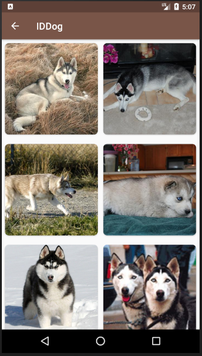

IDDog Android App
======================

Teste para a vaga de desenvolvedor android da IDwall

# Features

O aplicativo exibe uma lista de cards referentes a imagens de cachorros
que podem ser expandidas ao serem clicadas.

  

# Ambiente de Desenvolvimento

O app foi desenvolvido inteiramente em java e utiliza o sistema de build Gradle.

# Arquitetura

Segui todas as recomendações do [Guide to App Architecture](https://developer.android.com/jetpack/docs/guide)
quando decidi pela arquietura do app. Mantive as regras de negócio fora das activities e fragments e 
as coloquei em [ViewModel](https://developer.android.com/topic/libraries/architecture/viewmodel)s.
Utilizei [LiveData](https://developer.android.com/topic/libraries/architecture/livedata)
e [Data Binding Library](https://developer.android.com/topic/libraries/data-binding/)
para vincular os componentes do layout aos dados.

Utilizei repositórios para lidar com as operações de dados remotos.

Utilizei um Service Locator para injetar dependências do retrofit.

Utilizei o Espresso](https://developer.android.com/training/testing/espresso/)
para um teste básico de instrumentação e JUnit e 
[Mockito](https://github.com/mockito/mockito) para testes de unidade.

